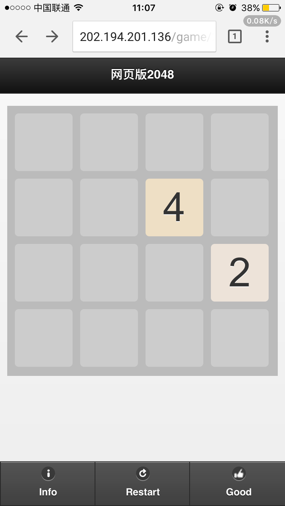

# game
<!DOCTYPE HTML PUBLIC "-//W3C//DTD HTML 4.01 Transitional//EN"
"http://www.w3.org/TR/html4/loose.dtd">
<html xmlns="http://www.w3.org/1999/xhtml">
	<head>
		<meta http-equiv="Content-Type" content="text/html; charset=utf-8" />
		<title>New Web Project</title>
	</head>
	<body>
		

			

				<h1 style="text-align: center;">2048网页版</h1>
				
			

		

	</body>
</html>

